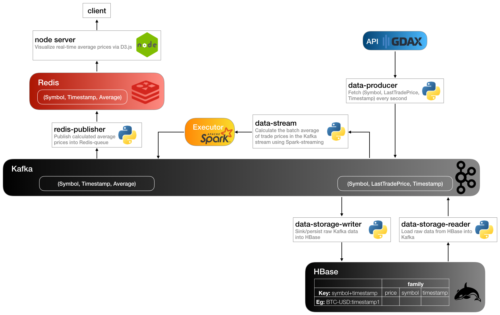

# Big Data System for Digital Currency Analysis

This system is a big data pipeline to analyze real-time prices of digital currencies, like bitcoin, litecoin, and etc. Considering large amounts of transactions happening every second, big data frameworks (HBase, Kafka, Spark, etc.) are used to build an efficient real-time pipeline to track currency prices.

## Architect

The major components are:

* data-producer:
	* fetch real-time `LastTradePrice` from gdax API every second and buffer them into a kafka data-bus.
* data-storage:
	* persist/sink data from kafka into hbase for later analysis usage.
* data-stream:
	* process data stream in kafka including calculating average, open, close, low, and high by using Spark Streaming.
* publish and display:
	* queue up real-time data in redis and display a user dashboard with nodeJS.

## Tech Stack
* [Zookeeper](https://zookeeper.apache.org) - a centralized service for maintaining configuration information, naming, providing distributed synchronization, and providing group services
* [Kafka](https://kafka.apache.org) - a toolbox to build real-time streaming data pipelines that reliably get data between systems or applications
* [HBase](http://hbase.apache.org) - an open-source, distributed, versioned, non-relational database modeled after Google's Bigtable
* [Spark](https://spark.apache.org/streaming/) - an extension of the core Spark API that enables scalable, high-throughput, fault-tolerant stream processing of live data streams
* [Redis](https://redis.io) - an in-memory data structure project implementing a distributed, in-memory key-value database with optional durability
* [ExpressJS](https://expressjs.com) - a minimal and flexible Node.js web application framework that provides a robust set of features for web and mobile applications

## Build Guide
See [this seperate markdown document](./build-guide.md)

#### Author: Wenzhe Xu

